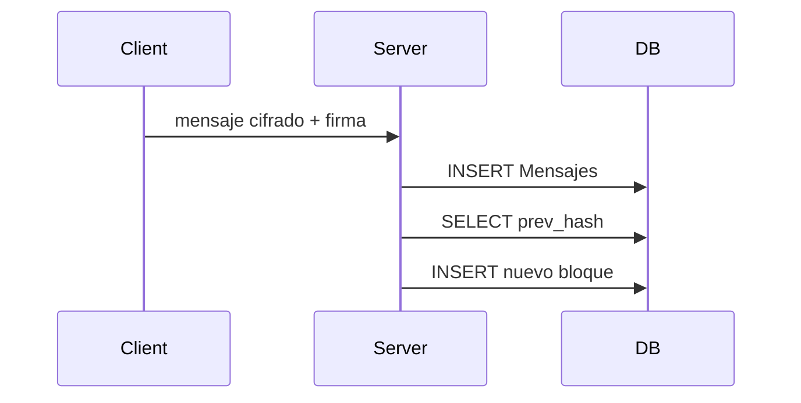

# Mini‑Blockchain interno


## 1. Estructura de un bloque

```jsonc
{
  "index"     : 17,
  "timestamp" : "2024‑11‑05T12:34:56Z",
  "prev_hash" : "0003bc…",
  "data"      : {
      "from"    : "alice",
      "to"      : "bob",
      "msgHash" : "9f0d…",   // SHA‑256 del ciphertext completo
      "sig"     : "3045…"    // firma ECDSA del remitente
  },
  "hash"      : "f8a9eb…"    // SHA‑256(prev_hash || timestamp || data)
}
```

| Campo | Función |
|-------|---------|
| `index` | Número incremental (bloque génesis = 0). |
| `prev_hash` | Enlaza con el bloque anterior; `000…0` si es génesis. |
| `data` | Metadatos, **no** mensaje claro; incluye hash del ciphertext y firma. |
| `hash` | Garantiza integridad: si un byte cambia, ya no coincide. |

---

## 2. Flujo de escritura

1. **Usuario envía mensaje** → se cifra (AES‑256‑GCM) y se firma (ECDSA).  
2. **Servidor** guarda el registro en tabla **Mensajes**.  
3. Construye `data` con `from`, `to`, `msgHash`, `sig`.  
4. Calcula:<br>
   `hash = SHA‑256(prev_hash || timestamp || JSON.stringify(data))`  
5. Inserta bloque nuevo en tabla **Blockchain**.



---

## 3. Endpoints

| Método | Endpoint | Acción |
|--------|----------|--------|
| **POST** | `/api/transactions` | Agrega un bloque con los metadatos de un mensaje. |
| **GET**  | `/api/transactions` | Devuelve toda la cadena (valida hashes en el proceso). |

---

## 4. Ventajas y límites

* **Inmutabilidad local**: si alguien edita un bloque intermedio, todo hash posterior cambia.  
* **Auditoría fácil**: quién envió y cuándo, sin revelar el mensaje claro.  
* **No reemplaza** una blockchain descentralizada; depende de la base de datos del servidor.  
* Recomendación: respaldar periódicamente el hash final en un log externo o servicio de timestamping.